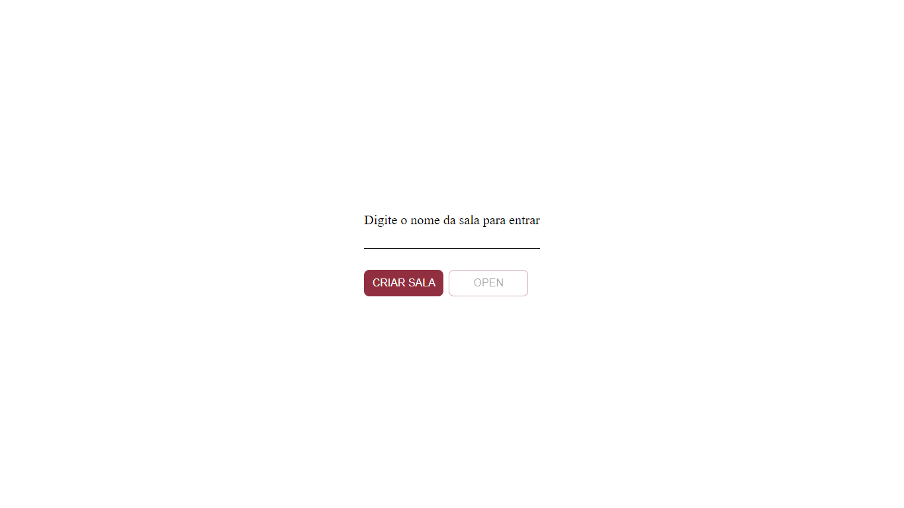
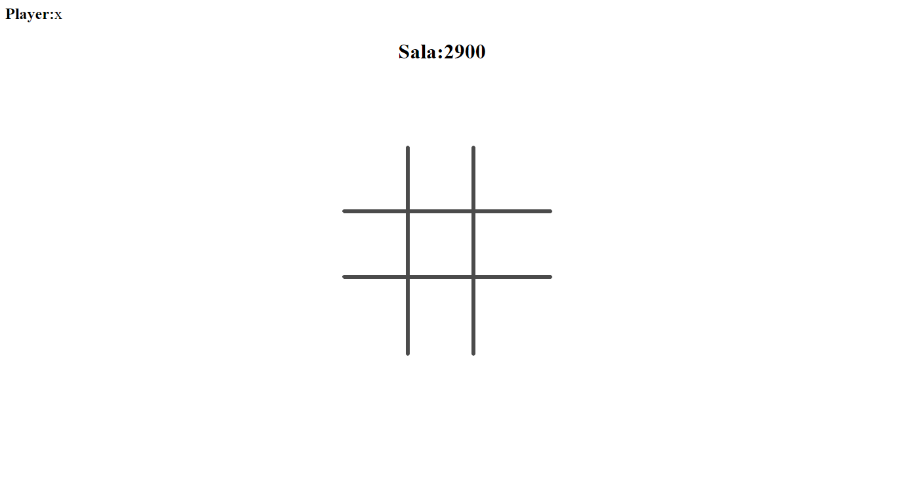
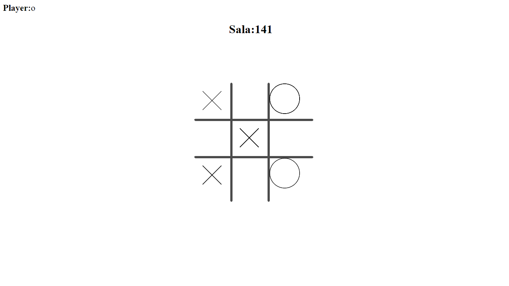
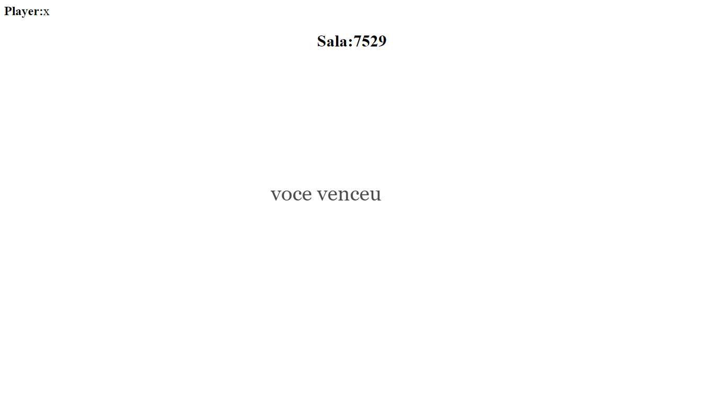

# Jogo da Velha

Jogo da Velha was with canvas


Criando ou entrando numa sala



Inicio do jogo



Continuação



Tela do Vencedor

## Tecnologias usadas

* ReactJs
* Express
* Typescript
* SocketIo
* MongoDb

## Environment Variables

Backend
* MONGO
* SOCKET_CLIENT
* PORT

## Install

```js
Backend
    cd server
    yarn
     or
    npm install
Frontend
    cd web
    yarn
     or
    npm install

```

## Running

```
Backend
    cd server
    yarn dev
       or
    npm run dev

Frontend
    cd web
    yarn start
        or
    npm start
```
